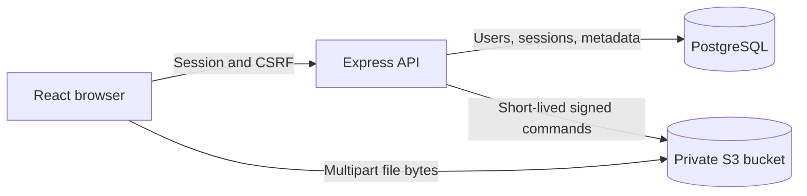

# Vaulta — Secure File Storage

Vaulta is a full-stack secure file storage service built entirely with JavaScript, React, Node.js/Express, PostgreSQL, and S3-compatible object storage.

Authenticated users can upload files up to 250 MiB each, manage them from a personal dashboard, keep them private, create revocable public sharing links, download them, and delete them safely.

The implementation prioritizes authorization and file safety. The object-storage bucket remains private, internal storage keys are never exposed as application identifiers, and large file bytes are uploaded directly from the browser to object storage instead of passing through the Express server.

## Core capabilities

- Account registration with a display name, email, and password
- Repeated-password confirmation on the registration page
- Argon2id password hashing
- Opaque, revocable sessions stored in `HttpOnly` cookies
- Session-bound CSRF protection for authenticated mutations
- Strict owner authorization for private files
- Multi-file upload queue with independent progress, cancellation, and retry
- Up to two files uploading concurrently
- Storage-level multipart uploads with up to three concurrent parts per file
- Upload support up to 250 MiB per file, covering the required 100 MB minimum
- Validation of filename, extension, declared MIME type, size, and file signature
- Private files by default
- Unguessable, revocable 256-bit public share tokens
- Dedicated public sharing page for recipients
- Five-minute presigned download URLs from a private bucket
- Confirmation popup before deleting a file
- Only validated `READY` files displayed in the dashboard
- Owner-scoped server search, visibility filtering, fixed sorting, numbered pagination, and cursor compatibility
- Persistent Favorites with accessible row controls
- Restorable Trash with explicit Trash-only permanent deletion
- Responsive interface with a sticky footer on large screens
- Custom Vaulta favicon
- SQL migrations, automated tests, linting, production build, and CI

The repeated-password field is validated only in the browser. It is never sent to the backend because the API only needs the final password. New accounts require a trimmed display name; accounts created before the name migration remain valid and receive a neutral greeting until profile editing is added.

## Architecture



The upload lifecycle is:

```text
UPLOADING → READY
UPLOADING → REJECTED
```

Only `READY` files can appear in the dashboard, be downloaded, or be made public. If the uploaded content does not match its declared type, the file becomes `REJECTED`, its stored object is deleted, and it is excluded from all user file lists.

Before setting a file to `READY`, the API verifies the actual object size and reads a small content prefix to validate its signature.

### Multi-file and multipart uploads

Vaulta uses two distinct upload layers:

- **Multi-file upload** means selecting one or multiple files, or dragging and dropping several files, into a queue. Every selected file is validated independently and has its own status, progress, cancellation, and retry controls. Success or failure is independent per file, so one failed file does not cancel files that uploaded successfully. The queue uploads at most two files concurrently.
- **Multipart upload** is the storage-level transfer used inside each individual queued file. One file is split into storage parts, with up to three parts transferred concurrently.

Each queued file independently uses the existing authenticated per-file multipart upload flow. The 250 MiB limit applies to each file. Supported formats remain JPG/JPEG, PNG, GIF, WebP, MP4, WebM, MOV, PDF, TXT, and ZIP.

## Project structure

```text
backend/
  migrations/          PostgreSQL schema and migrations
  src/
    config/            Validated environment configuration
    db/                Database pool, migrations, and repositories
    middleware/        Authentication, CSRF, and error handling
    routes/            REST endpoints and request validation
    services/          Authentication and file lifecycle rules
    storage/           S3-compatible storage adapter
  test/                Backend tests

frontend/
  public/              Static assets and favicon
  src/
    api/               API client and multipart uploader
    components/        Dashboard and reusable interface components
    context/           Authentication state
    pages/             Login, registration, dashboard, and sharing pages

docs/
  openapi.yaml         REST API contract
  SECURITY.md          Threat model and production hardening
  DECISIONS.md         Architecture and engineering decisions
```

## Requirements

- Node.js 22.12 or newer
- npm
- Docker
- Docker Compose

## Environment configuration

Create the local environment file from the provided template:

```bash
cp .env.example .env
```

The application reads `.env`. The `.env.example` file is only a safe configuration template that can be committed to GitHub.

Never commit `.env`, because it may contain database and object-storage credentials.

## Local installation

From the project root, install the dependencies:

```bash
npm install
```

Start PostgreSQL and MinIO:

```bash
docker compose up -d
```

Verify the containers:

```bash
docker compose ps -a
```

The expected state is:

- PostgreSQL is running and healthy.
- MinIO is running.
- `create-bucket` exits with code `0` after creating the private bucket.

Apply the PostgreSQL migrations:

```bash
npm run db:migrate
```

Start the backend and frontend development servers:

```bash
npm run dev
```

Open the application at [http://localhost:5173](http://localhost:5173).

Local services:

| Service | Address |
| --- | --- |
| React application | `http://localhost:5173` |
| Express API | `http://localhost:4000` |
| MinIO API | `http://localhost:9000` |
| MinIO console | `http://localhost:9001` |

The credentials provided in `.env.example` are intended only for local development. Never reuse them in production.

## Commands

| Command | Purpose |
| --- | --- |
| `npm run dev` | Run the Express API and React development server |
| `npm run db:migrate` | Apply pending SQL migrations transactionally |
| `npm run lint` | Run ESLint for the backend and frontend |
| `npm test` | Run backend and frontend automated tests |
| `npm run build` | Create the production frontend bundle |
| `npm start` | Start the Express API |

## API overview

| Method | Endpoint | Access | Purpose |
| --- | --- | --- | --- |
| `POST` | `/api/auth/register` | Public | Create an account and session |
| `POST` | `/api/auth/login` | Public | Authenticate and create a session |
| `GET` | `/api/auth/me` | Authenticated | Restore the current user |
| `POST` | `/api/auth/logout` | Authenticated + CSRF | Revoke the current session |
| `GET` | `/api/files` | Owner | Search, filter, sort, and paginate active, recent, favorite, or trashed files |
| `POST` | `/api/files/uploads` | Owner + CSRF | Initialize a multipart upload |
| `POST` | `/api/files/:id/parts` | Owner + CSRF | Sign selected upload parts |
| `POST` | `/api/files/:id/complete` | Owner + CSRF | Verify and complete an upload |
| `PATCH` | `/api/files/:id` | Owner + CSRF | Change public/private visibility |
| `PATCH` | `/api/files/:id/favorite` | Owner + CSRF | Set persistent favorite state |
| `POST` | `/api/files/:id/trash` | Owner + CSRF | Move an active file to Trash without deleting storage |
| `POST` | `/api/files/:id/restore` | Owner + CSRF | Restore a trashed file |
| `GET` | `/api/files/:id/download` | Owner | Obtain a short-lived download URL |
| `DELETE` | `/api/files/:id` | Owner + CSRF | Abort an upload or permanently delete a trashed file |
| `GET` | `/api/storage/stats` | Owner | Read authoritative READY-file counts and byte usage |
| `GET` | `/api/public/:shareToken` | Public | Read public file metadata without exposing storage details |
| `GET` | `/api/public/:shareToken/download` | Public | Obtain a short-lived signed download URL |

All API errors use the following structure:

```json
{
  "error": {
    "code": "ERROR_CODE",
    "message": "Human-readable message",
    "requestId": "request-identifier"
  }
}
```

See [`docs/openapi.yaml`](docs/openapi.yaml) for the complete request and response schemas.

Storage file counts describe active, non-trashed `READY` records and are independent of paginated lists.
`usedBytes` includes every `READY` stored object, including Trash, because moving a file does not free
storage. Permanent deletion removes the object and reduces usage. `UPLOADING` and `REJECTED` records are
excluded. The API reports a single assessment-wide quota of 1 GiB (1,073,741,824 bytes); this quota is informational
until a future atomic upload-reservation mechanism can enforce it safely across concurrent uploads.

## Security design

### Authentication

- Passwords are hashed with Argon2id.
- Authentication uses random server-side sessions.
- The browser stores only an opaque session identifier in an `HttpOnly` cookie.
- Session cookies use `SameSite` protection.
- Authentication endpoints are rate limited.

### Authorization

Every private file query is scoped by both the file identifier and authenticated owner identifier. A user cannot read, modify, publish, download, or delete another user's file.

### CSRF protection

Authenticated state-changing requests require a session-bound CSRF token. Login CSRF is also mitigated by validating the request origin.

### File validation

The application validates:

- allowed file extensions;
- declared MIME types;
- maximum size;
- actual object size after upload;
- content signatures using magic bytes.

A filename or browser-provided MIME type alone is never considered sufficient proof of the real file type.

### Public sharing

The storage bucket is never public. Public access uses an unguessable application share token. `GET /api/public/:shareToken` returns only the public filename, MIME type, size, and configured download-expiry duration. The separate `/download` endpoint authorizes the transfer and returns a short-lived signed object-storage URL.

The signed download URL expires after five minutes. Invalid token formats receive a structured validation error, while unknown, private, or trashed files are reported as unavailable without exposing their state. Making a file private revokes its application share token; an already-issued signed storage URL can remain usable only until its short expiry. This prevents the application from exposing permanent storage URLs or private object keys.

## Interface behavior

- The dashboard uses five-file server pages with deterministic sorting and literal, debounced filename search.
- Dashboard, My Files, Shared files, Recent, Favorites, and Trash are URL-backed views. Shared files means public files owned by the signed-in user.
- Trashed public files immediately stop resolving through public links; restoration preserves their prior visibility and favorite state.
- The registration form requires the password to be entered twice.
- Account creation is blocked when both passwords differ.
- Deleting a file opens an accessible confirmation dialog.
- Cancelling the dialog leaves the file unchanged.
- The dashboard shows only successfully validated files.
- The footer remains at the bottom on large screens, including pages with little content.
- The browser tab uses the custom Vaulta favicon.

These interface-only behaviors do not change the REST API contract.

## AWS S3 deployment notes

Keep S3 Block Public Access enabled. Grant the backend role only the required actions on the application's storage prefix: multipart creation, part signing, completion, abort, `HeadObject`, ranged `GetObject`, and deletion.

Configure bucket CORS so the frontend origin can upload with `PUT` and read the `ETag` response header:

```json
[
  {
    "AllowedOrigins": ["https://files.example.com"],
    "AllowedMethods": ["GET", "PUT", "HEAD"],
    "AllowedHeaders": ["*"],
    "ExposeHeaders": ["ETag"],
    "MaxAgeSeconds": 3600
  }
]
```

For production, also use:

- TLS for every connection;
- IAM roles instead of long-lived access keys;
- bucket-default encryption;
- a lifecycle rule that removes incomplete multipart uploads;
- a production database with encrypted backups;
- centralized rate limiting if the API runs on multiple instances.

Set `S3_ENDPOINT` only when using a compatible local provider such as MinIO. Set `S3_SSE=AES256` when server-side encryption is not already enforced by the bucket.

## Authentication responsiveness

Successful login returns the safe authenticated-user projection and hydrates frontend auth state directly. `/api/auth/me` remains the authority for restoring an existing session after a full-page load, but it is not repeated after login. The dashboard shell renders before its independent file and storage-stat requests finish.

Login uses a 45-second client timeout to accommodate an idle hosted service without spinning indefinitely. After three seconds, the form displays delayed idle-service guidance; network, timeout, and invalid-credential failures remain distinct and safe to retry. Unknown-email verification still performs Argon2id work against a precomputed valid dummy hash, avoiding process-start hashing without weakening enumeration resistance.

Application changes cannot eliminate a hosting provider's process sleep, database wake-up, DNS, or TLS latency. For predictable production sign-in latency, use an always-on backend tier and place the backend and PostgreSQL service in the same or nearby region. Do not add a frontend health-check request before login, because that adds another round trip.

## Engineering scope

The project is intentionally compact enough for a take-home assignment while implementing the core requirements to a production-minded standard.

Potential production extensions include:

- antivirus or Content Disarm and Reconstruction processing;
- password reset;
- atomic storage-quota reservations and enforcement;
- object versioning;
- account deletion;
- distributed rate-limit storage;
- background cleanup jobs;
- audit-log export.

These extensions are documented as future improvements and are not presented as already implemented.

## References

- [OWASP File Upload Cheat Sheet](https://cheatsheetseries.owasp.org/cheatsheets/File_Upload_Cheat_Sheet.html)
- [Amazon S3 multipart upload](https://docs.aws.amazon.com/AmazonS3/latest/userguide/mpuoverview.html)
- [Amazon S3 presigned URLs](https://docs.aws.amazon.com/AmazonS3/latest/userguide/using-presigned-url.html)
- [Microsoft REST API design best practices](https://learn.microsoft.com/en-us/azure/architecture/best-practices/api-design)

## License

This project was created as a technical assignment and is provided for evaluation purposes.
